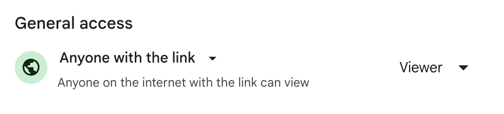

# Database Architecture Practice: Offer Right

Let's get some more practice designing databases. This time, we'll design a data model for an app called Offer Right.

## Offer Right

Before you begin, remind yourself of [our goal](https://learn.firstdraft.com/lessons/320-yap-database-architecture#our-goal), and our [two database constraints](https://learn.firstdraft.com/lessons/320-yap-database-architecture#database-design-constraint-one).

Then, click around [Offer Right](https://offer-right.matchthetarget.com/). It's a simplified version of the real [Offer Up](https://offerup.com/) — a two-sided market.

Users can:

- post items to sell
- browse items to purchase
- chat with sellers to make offers
- sellers can mark items as sold once satisfied
- buyers and sellers coordinate meeting up on their own

You can sign in with any of the following (all of their passwords are **password**):

- alice@example.com
- bob@example.com
- carol@example.com
- eve@example.com
- Or you can sign up for your own new account (it doesn't need to be a real email address).

Identify all of the screens in the app. On each screen:
- What information can you see?
- What actions can you take? Usually, this means: "what links and buttons can you click?"

For each action:
- What screen do you end up on after you take it?
- What information was created/read/updated/deleted along the way?

Keeping the notes you took above in mind: design a data model that can support all user actions that you observe in app. I.e., a complete listing of tables and columns.

Imagine that it's a mockup, and that you've been hired to build an app like that. (Don't come up with additional features or improvements; our job is to build it as it is now.)

I find it helpful to use paper or a spreadsheet to actually draw out all my tables, columns, and try entering in rows to make sure I can record everything necessary for all screens and possible user actions that I can see in the mockup.

### Offer Right: Spreadsheet

Please create a spreadsheet using [Google Sheets](https://sheets.google.com) and share your url. It should be something like this: `docs.google.com/spreadsheets/<...>`. Make sure anyone with the link can view.

- Did you create a spreadsheet with the tables, columns, and rows of sample data?
- Yes
  - Great job!
- No
  - Please create your spreadsheet before continuing.
{: .free_text #offer_right_spreadsheet title="Offer Right: Spreadhseet" points="1" answer="1" }

Return to Canvas and submit the URL in the assignment "Offer Right: Spreadsheet".

An instructor will provide additional feedback on your submission there.

### Offer Right: Entity Relationship Diagram (ERD)

Please create a entity relationship diagram (ERD) using [Ideas Tool](https://ideas.firstdraft.com).

- Did you create a entity relationship diagram (ERD)?
- Yes
  - Great job!
- No
  - Please create your entity relationship diagram (ERD) before continuing.
{: .free_text #offer_right_erd title="Offer Right: Entity Relationship Diagram (ERD)" points="1" answer="1" }

Return to Canvas and submit a screenshot of your ERD in the assignment "Offer Right: Entity Relationship Diagram (ERD)".

An instructor will provide additional feedback on your submission there.

---

- Approximately how long (in minutes) did this lesson take you to complete?
{: .free_text_number #time_taken title="Time taken" points="1" answer="any" }
